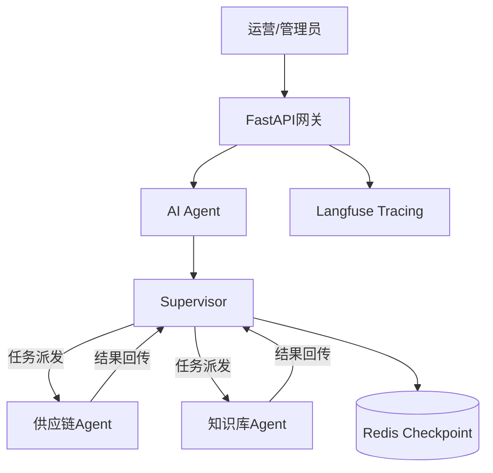

# 库存智能助手

## 项目简介
Inventory Agent (库存智能助手) 是一个面向供应链场景的生产级、多智能体协作系统。它源于一个真实的业务痛点：在支付系统中库存扣减异常的排查与处理长期依赖人工，补货需要结合多种数据作为参考。

本项目将其改造为一个由AI驱动的运营工作台，将自然语言指令转化为对库存、采购、规则知识库的自动操作。其核心演进是从一个简单的查询工具，发展为具备规划、执行、自省与稳定保障能力的多智能体协同系统。

## 🎯解决的核心问题
- 流程提效：将“异常识别 → 人工核查 → 跨系统查询 → 决策执行”的长链路压缩为“自然语言对话”。
- 知识固化：将散落在文档、Wiki与资深员工头脑中的采购规则、商品术语，通过RAG系统沉淀为随时可查的“企业记忆”。
- 成本与稳定性：攻克多智能体应用中常见的上下文膨胀、Token成本失控、死循环等生产落地难题。

## 🚀为何这个项目值得关注？
这并非另一个“基于LangChain的Demo”。它完整呈现了一个AI智能体从解决一个简单问题开始，逐步应对工程化、成本与复杂性挑战，最终通过自研核心架构实现生产级稳定的全过程。它证明了开发者不仅能够“使用”AI框架，更具备定义问题、架构系统与解决规模化挑战的工程能力。

## 核心能力
- **Agent架构设计：** 设计并实现多Agent协作架构，通过角色整合优化减少系统输出不确定性。
- **Prompt Engineering：** 采用混合提示词策略，通过上下文优化实现Token消耗显著降低。
- **RAG知识库优化：** 通过检索策略优化，实现86%的知识库召回率（RAGAS评估）。
- **系统稳定性保障：** 实现多层级故障防护机制，确保生产环境稳定运行。
- **可观测性建设：** 集成链路追踪系统，便于问题定位和后续优化。
- **可移植性设计：** 配置中心化，降低多环境部署的配置管理负担。
- **LLM 应用集成：** 支持多模型接入，灵活适配不同业务场景需求。
- **质量保障机制：** 引入自检机制提升回答可靠性。

## 系统架构图

## 运行指标
- 推理成本优化：单次推理Token消耗实现显著下降（降幅>95%）
- 知识库召回率：86%（RAGAS + 人工标注评估）
- 系统稳定性：多智能体架构自上线以来零死循环/无限递归（多层级防护兜底）
- 并发支持：支持多会话并发（分布式状态管理）

## 项目里程碑
### 版本 1.0：交互式单体智能体
**目标**：将扣减库存异常的人工核查流程自动化，提供基础的AI交互入口。

#### 核心特性
- **核心功能**：接收自然语言指令，查询实时库存状态。
- **架构**：单体、交互式Agent架构。
- **前端**：基于Gradio构建简易Web界面，实现快速原型验证。
- **集成**：实现“用自然语言管库存”的目标。
- **部署**：部署于K8S，配备流水线与全链路观测。

#### 技术栈
- **AI框架**：LangChain
- **前端/接口**：Gradio
- **部署**：Kubernetes

---

### 版本 2.0：生产就绪的增强型智能体
**目标**：解决1.0版本在真实使用中暴露的交互、成本与知识瓶颈，使其达到可生产部署标准。

#### 核心特性
- **交互增强**：
  - 引入短期记忆与多轮对话能力。
  - 管理对话历史长度。
- **工程化重构**：
  - 前后端分离，前端独立部署。
  - 引入JWT鉴权，保障服务安全。
  - 引入FastAPI。
  - 移除Gradio。
- **知识增强**：
  - 集成RAG（检索增强生成）系统，接入采购知识库。
  - 优化检索质量。
  - 经RAGAS评估，召回率达86%。
- **稳定性**：支持意外中断后对话恢复。

#### 关键技术决策
- **评估**：引入RAGAS框架进行检索系统量化评估。
- **架构**：重构为前后端分离，引入知识库。

---

### 版本 3.0：自研Supervisor的多智能体协作系统
**目标**：应对复杂任务，通过智能体分工协作提升处理能力与系统可维护性，并解决多智能体成本与稳定性问题。

#### 核心特性
- **多智能体架构**：
  - 职责分离：
    - **供应链Agent**：负责库存查询、补货建议、采购申请等操作型任务。
    - **知识库Agent**：负责规则查询、术语解答等知识型任务。
- **稳定性**：
  - 解决智能体死循环问题。
  - 完善检查点与状态恢复机制。
  - 结构化输出。

#### 架构演进意义
此版本标志着项目从一个“AI功能点”演进为一个**自主设计、稳定可控的AI智能体**。自研的多智能体架构体现了对生产环境成本、可控性及稳定性的深度考量，而非单纯使用开源框架。

## 技术选型
| 开发语言及工具 | 用途                           |
| -------------- | ------------------------------ |
| kubernetes     | 容器编排                       |
| docker         | 容器运行                       |
| jenkins        | CI/CD                          |
| MySQL          | 持久层                         |
| Apisix         | API网关                        |
| harbor         | docker私有仓库                 |
| python         | 开发语言                       |
| Consul         | 服务注册/发现                  |
| Kafka          | 消息队列                       |
| langchain      | 开发框架                       |
| Milvus         | 向量数据库                     |
| langgraph      | 多智能体协作                   |
| RAGAS          | RAG评估                        |
| Redis-stack    | 检查点、短期记忆、顶层应用缓存 |

## 大模型
- 嵌入模型
- 多语言模型

## 本地开发指南
环境依赖：
- Docker 20.10.7+
- docker-compose

## 快速启动
1. 复制配置：`cp docker-compose-dev.yml docker-compose.yml`，填写必要的环境变量，详情见配置项。
2. 构建镜像：`docker build -t stock-alert:local .`
3. 启动服务：`docker-compose up -d`

## 关键配置项（详见 docker-compose-dev.yml）
| 配置项            | 说明                     |
| ----------------- | ------------------------ |
| CONSUL_HOST       | Consul 服务地址          |
| MICROSERVICE_URL  | 后端微服务地址           |
| DASHSCOPE_API_KEY | 阿里云 DashScope API Key |
| JWT_SECRET_KEY    | JWT 密钥                 |
