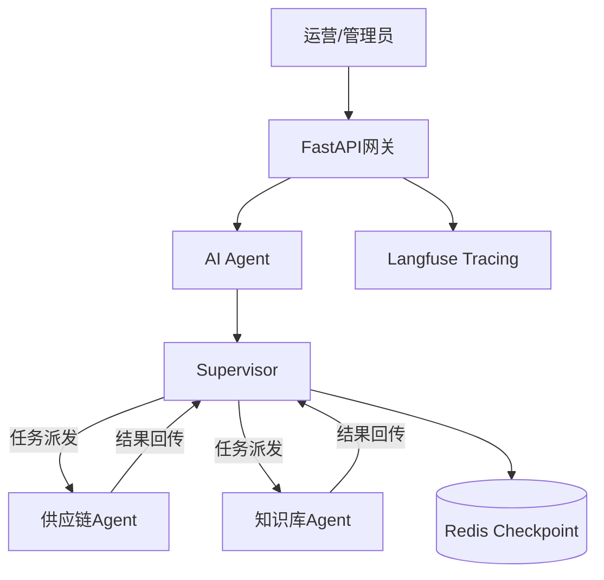

# 库存智能助手

[](https://www.python.org/)
[](https://langchain-ai.github.io/langgraph/)
[](https://www.langchain.com/)
[](https://milvus.io/)

## 项目简介
Inventory Agent (库存智能助手) 是一个面向供应链场景的生产级、多智能体协作系统。它源于一个真实的业务痛点：在支付系统中库存扣减异常的排查与处理长期依赖人工，补货需要结合多种数据作为参考。

本项目将其改造为一个由AI驱动的运营工作台，将自然语言指令转化为对库存、采购、规则知识库的自动操作。其核心演进是从一个简单的查询工具，发展为具备规划、执行、自省与稳定保障能力的多智能体协同系统。

## 🎯解决的核心问题
- 流程提效：将“异常识别 → 人工核查 → 跨系统查询 → 决策执行”的长链路，压缩为“自然语言对话”。
- 知识固化：将散落在文档、Wiki与资深员工头脑中的采购规则、商品术语，通过RAG系统沉淀为随时可查的“企业记忆”。
- 成本与稳定性：攻克了多智能体应用中常见的上下文膨胀、Token成本失控、智能体死循环等生产落地难题。

## 🚀为何这个项目值得关注？
这并非另一个“基于LangChain的Demo”。它完整呈现了一个AI智能体从解决一个简单问题开始，逐步应对工程化、成本与复杂性挑战，最终通过自研核心架构实现生产级稳定的全过程。它证明了开发者不仅能够“使用”AI框架，更具备定义问题、架构系统与解决规模化挑战的工程能力。

## 核心能力
- **Agent架构设计：** 设计并实现supervisor-worker 多Agent协作架构，解决了supervisor多轮对话中消息历史线性增长导致的上下文噪声问题，整合业务领域Worker从**4** 个精简至**2** 个，大幅降低调度过程中往返supervisor节点的token消耗。
- **Prompt Engineering：** 结构化输出设计、混合提示词策略、上下文摘要压缩，有效控制token消耗。
- **RAG知识库优化：** 混合搜索（HNSW + BM25）、数据清洗、相似度调优，通过RAGAS + 人工双重评估，知识库召回率达86%。
- **系统稳定性保障：** 检查点机制、工具/节点重试策略、递归熔断保护，提升Agent自愈能力。
- **可观测性建设：** 集成Langfuse实现链路追踪，便于问题定位和后续优化。
- **可移植性设计：** Consul K/V配置中心化 + ConfigMap注入提示词，降低多环境部署的配置管理负担。
- **LLM 应用集成：** 集成DashScope（通义千问）、OpenAI，支持多模型。

## 系统架构图


## 运行指标
- 单次推理token消耗从22K → ~1.5K（降幅>95%）
- RAG知识库召回率86%（RAGAS + 人工标注评估）
- Multi-Agents架构自上线以来0次死循环/无限递归（熔断+检查点兜底）
- 支持并发sessions（Redis checkpoint）。

## 稳定性设计
| 风险                          | 策略                                             |
| ----------------------------- | ------------------------------------------------ |
| 无限递归/agent死循环          | 递归深度计数器 + 硬熔断 + 任务分发机制 + 强制CoT |
| 工具调用失败（下游 API 抖动） | 指数退避重试（3 次）                             |
| 会话中断恢复                  | Redis checkpoint（每轮写入，恢复时重放摘要）     |
| Token预算耗尽                 | 上下文摘要压缩触发阈值                           |
| 上下文污染                    | 任务分发机制                                     |

## 项目里程碑
### 版本 1.0：交互式单体智能体
**目标**：将扣减库存异常的人工核查流程自动化，提供基础的AI交互入口。

#### 核心特性
- **核心功能**：接收自然语言指令，查询实时库存状态。
- **架构**：单体、交互式Agent架构。
- **前端**：基于Gradio构建简易Web界面，实现快速原型验证。
- **集成**：作为自研EDA支付系统的一个附属服务，监听特定业务事件。

#### 技术栈
- **AI框架**：LangChain
- **前端/接口**：Gradio
- **部署**：Docker容器化

---

### 版本 2.0：生产就绪的增强型智能体
**目标**：解决1.0版本在真实使用中暴露的交互、成本与知识瓶颈，使其达到可生产部署标准。

#### 核心特性
- **交互增强**：
  - 引入短期记忆与多轮对话能力。
  - 实现上下文摘要压缩，有效管理对话历史长度。
- **工程化重构**：
  - 前后端分离，前端独立部署。
  - 引入JWT鉴权，保障服务安全。
  - 引入FastAPI。
  - 移除Gradio。
- **知识增强**：
  - 集成RAG（检索增强生成）系统，接入采购知识库。
  - 采用混合搜索（向量检索 + BM25）与重排序技术，优化检索质量。
  - 经RAGAS评估，召回率达到86%。
- **稳定性**：实现对话检查点机制，支持意外中断后对话恢复。

#### 关键技术决策
- **存储**：使用Milvus作为向量数据库。
- **评估**：引入RAGAS框架进行检索系统量化评估。
- **架构**：重构为前后端分离，引入知识库。

---

### 版本 3.0：自研Supervisor的多智能体协作系统
**目标**：应对复杂任务，通过智能体分工协作提升处理能力与系统可维护性，并解决多智能体Token成本与稳定性问题。

#### 核心特性
- **多智能体架构**：
  - 采用`Supervisor-Worker`协作模式。
  - 职责分离：
    - **供应链Agent**：负责库存查询、补货建议、采购申请等操作型任务。
    - **知识库Agent**：负责规则查询、术语解答等知识型任务。
- **自研Supervisor**：
  - **痛点驱动**：为彻底解决LangGraph等框架存在的“全量消息传递”导致的上下文噪声与Token爆炸问题。
  - **核心创新**：Worker仅输出最终结果。Supervisor负责维护压缩后的全局摘要与任务路由。
  - **成效**：将复杂任务的单轮平均Token消耗从**~22K降至~1.5K**，降低超过95%。
- **企业级稳定性**：
  - 引入熔断与递归深度保护机制，彻底解决智能体死循环问题。
  - 完善检查点与状态恢复机制。
  - 部署于K8S，配备完整的CI/CD流水线与基于Langfuse的全链路观测。

#### 架构演进意义
此版本标志着项目从一个“AI功能点”演进为一个**自主设计、稳定可控的AI智能体**。自研Supervisor的决策体现了对生产环境成本、可控性及稳定性的深度考量，而非单纯使用开源框架。

## 与langgraph-supervisor的区别
| 功能点                  | langgraph-supervisor | 本项目的supervisor架构 |
| ----------------------- | -------------------- | ---------------------- |
| Worker消息传输机制      | 全量传输             | 仅传递任务相关信息     |
| 上下文噪声              | √                    | ×                      |
| 可追溯性                | ×                    | √                      |
| 结构化输出              | ×                    | √                      |
| supervisor可控性        | ×                    | √（自由定制）          |
| 多意图任务token消耗成本 | 高                   | 低                     |

## 目录结构
```tree
│
├── config/                     # 配置文件
│   └── prompts/                # 提示词模板
│
├── docs/                       # 文档
│
├── src/                        # 源代码主目录
│   ├── agents/                 # Agent定义
│   ├── api/                    # API接口层
│   │   ├── middleware/         # 中间件
│   │   └── routers/            # 路由
│   ├── core/                   # 核心运行时与共享组件
│   │   └── llm/                # LLM模型封装
│   ├── events/                 # 事件处理层
│   │   ├── handlers/           # 事件处理器
│   │   └── protos/             # Protobuf定义
│   ├── graph/                  # LangGraph工作流
│   ├── knowledge/              # RAG知识库
│   ├── memory/                 # 记忆管理
│   ├── repository/             # 数据访问层
│   ├── service/                # 业务逻辑层
│   ├── storage/                # 存储层
│   ├── tools/                  # 工具
│   └── utils/                  # 通用工具函数
│
├── tests/                      # 测试
│
├── Dockerfile                  # Docker构建文件
├── docker-compose.yml          # Docker Compose配置
├── pyproject.toml              # 项目依赖配置
└── uv.lock                    # 依赖锁文件
```

## 技术选型
| 开发语言及工具 | 版本    | 用途                           |
| -------------- | ------- | ------------------------------ |
| kubernetes     | 1.23.1  | 容器编排                       |
| docker         | 20.10.7 | 容器运行                       |
| jenkins        | 2.346.1 | CI/CD                          |
| MySQL          | 8.0.45  | 持久层                         |
| Apisix         | 3.4.1   | API网关                        |
| harbor         | 1.8.6   | docker私有仓库                 |
| python         | 3.13.9  | 开发语言                       |
| Consul         | 1.7.3   | 服务注册/发现                  |
| Kafka          | 3.0.1   | 消息队列                       |
| langchain      | 1.2.12  | 开发框架                       |
| Milvus         | 2.6.13  | 向量数据库                     |
| langgraph      | 1.1.0   | 多智能体协作                   |
| RAGAS          | 0.4     | RAG评估                        |
| Redis-stack    | 7.2     | 检查点、短期记忆、顶层应用缓存 |

## 大模型
- text-embedding-v4（嵌入模型）
- qwen-plus
- openai/gpt-5.4

## 本地开发指南
环境依赖：
- Docker 20.10.7+
- docker-compose

## 快速启动
1. 复制配置：`cp docker-compose-dev.yml docker-compose.yml`，填写必要的环境变量，详情见配置项。
2. 构建镜像：`docker build -t stock-alert:local .`
3. 启动服务：`docker-compose up -d`

## 关键配置项（详见 docker-compose-dev.yml）
| 配置项            | 说明                     |
| ----------------- | ------------------------ |
| CONSUL_HOST       | Consul 服务地址          |
| MICROSERVICE_URL  | 后端微服务地址           |
| DASHSCOPE_API_KEY | 阿里云 DashScope API Key |
| JWT_SECRET_KEY    | JWT 密钥                 |
